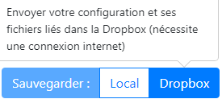
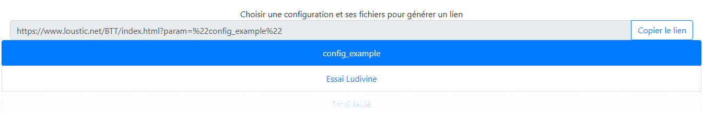
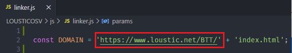

### ✔️ Vous êtes au bon endroit pour télécharger l'outil !
# LOUSTIC BTT - Behavior Tracking Tool

BTT est un outil de suivi basé sur les technologies HTML5/CSS3/Javascript8.
L'objectif est de pouvoir créer une suite de médias qu'un participant pourra ensuite visionner, tout en récupérant son activité sur la page. 
L'application se découpe en trois grandes parties :

 - Une interface de **configuration** : onglet **Configurateur**
 - Un générateur de **lien** pour réaliser un test en ligne : onglet **Partager un test**
 - Une interface de **test** locale : onglet **Lancer un test (Local)**

De plus une application en ligne est déployée afin de pouvoir réaliser des tests en ligne. Cette interface est accessible depuis un lien spécifique généré par l'outil de configuration présent. Les résultats de ces tests en ligne seront automatiquement envoyés dans une Dropbox. 

### Sommaire :

 - Installation
 - Créer / Modifier une configuration
 - Lancer un test
 - Données de sortie
 - Modification du domaine et déploiement tests en ligne

 *(Ceci étant un projet en cours de développement, toutes ces informations sont susceptibles d'être mises à jour à chaque update.)*

Un tutoriel détaillé et imagé est disponible via [ce lien](https://docs.google.com/presentation/d/1lUJykDOnX4R6eeXbdpBOb0G16N9s28p8Di44IV6U5E0/edit?usp=sharing)

⚠️ **Attention certaines configurations faites avant les dernières mise à jour ne sont plus compatibles avec l'outil (celles ayant des média de type texte). La rétrocompatibilté avec l'ancien format des textes n'ayant pas pu être développée à temps.** 
Il est possible de les réparer à la main si cela est vraiment nécessaire ([voir guide](https://docs.google.com/document/d/1yaFlWgYcKNZGbDMxfdlW4_AiBWo89dJncKYN1kq3vW0/edit?usp=sharing)).

# Installation
**Sous Windows :**

 1. Sur [cette page](https://github.com/Valoute-GS/LOUSTICOSV/tree/master) si ce n'est pas déja le cas 
**⤓ Code** ➔ **Download ZIP**

  

 2. Extraire l'archive dans le répertoire désiré.
 3. Entrer dans le dossier
 4. Exécuter le ficher `index.html` dans votre navigateur dépféré

 Navigateurs testées : Chrome/Mozilla/Opéra

# Créer / modifier une configuration
Cette fonction est accessible depuis l'accueil ou depuis l'onglet **Configurateur** dans la barre de navigation.
Elle est destinée à être utilisée par le chercheur qui veut créer une nouvelle configuration de zéro ou bien modifier une configuration existante.

Une **Configuration** est composée de :

 - Un **Titre** nécessaire
 - Des **Options** activables
 - Une liste non nulle de **Pages** configurables

Chaque **Page** est définie par :

 - Un **Titre** (facultatif)
 - Un **Format** : vidéo/texte (d'autres formats sont prévus et en cours de développement)

La page peut être configurée en appuyant sur le bouton **Configurer**, cette action menant sur une page spécifique en fonction du format sélectionné au préalable.
Une page, une fois finie et valide, peut être sauvegardée via le bouton **Sauvegarder**. Il est aussi possible d'abandonner les modifications avec le bouton **Annuler**.

La configuration, une fois finie et valide, peut être : 
 - Téléchargée en local via le bouton **Local**, cela déclenche le téléchargement d'un fichier de configuration au format `.json`

  

 - Envoyée dans une Dropbox via le bouton **Dropbox**, cela déclenche l'envoi des fichiers, si une configuration similaire existe déjà vous pouvez la renomer, ou bien il vous sera proposé de l'écraser.

  

### Format Vidéo
Une page de type **Vidéo** est composée de :

 - Un **fichier vidéo** : nécessaire au format .mp4 (conseillé), .webm, .mov (suivant les navigateurs certains formats ne son pas pris en charge), **fichier local** à importer dans le champs prévu
 - Des **Options** activables : changeant la mise en forme et les interactions possibles lors du test
 - Une liste de **Chapitres** (facultatifs) :  composé d'un **Titre** et d'un **Timestamp** nécessaires.

### Format Editeur de texte/médias
Une page de type **Editeur de texte/médias** est composée de :
 - Une **zone de texte** simple mais riche. Il est ainsi possible d'insérer des images, des vidéos du web (nécessite une connexion internet),etc. en plus des fonction d'éditions classiques.
 - Des **Options** activables : changeant les interactions de l'utilisateur possible avec l'éditeur de text.

### Format PDF
Une page de type **PDF** est composé de :
 - Un **fichier PDF** : nécessaire au format .PDF, .webm, .mov (suivant les navigateurs certains formats ne son pas pris en charge), **fichier local** à importer dans le champ en bas de page
 - Des **Options** activables : changeant la mise en forme et les interactions possibles lors du test
 - Une liste de **Chapitres** (facultatifs) :  composé d'un **Titre** et d'un **numéro de pages** nécessaires.

### Modifier une configuration
Il est possible de charger une configuration, présente sur l'ordinateur, au format .json depuis le champs **Charger un fichier de configuration** puis ses **fichiers associés**. Une fois tous les fichiers importés, cliquer sur **Charger**. Ensuite cela se déroule comme pour une nouvelle configuration.

  

**Infos** : afin de sauvegarder les modifications il est nécessaire de sauvergarder de nouveau la configuration, le fichier de configuration téléchargé n'écrasera pas la configuration source même si elle a le même nom.
De plus une configuration dsponnible sur le Dropbox ne peut pour le moment pas directement être modifiée. Il faut la télécharger sur votre ordinateur avec ses fichiers liés pour la modifier dans l'outil, vous pourrez tout de même la réenvoyer vers la Dropbox pour la remplacer.

# Partager un test

Cette fonction est accessible depuis l'accueil ou depuis l'onglet **Partager un test** dans la barre de navigation.
Elle permet de générer des liens de partage permettant de réaliser un test en ligne. Il peut donc être diffusé, les résultats seront concentrés dans la Dropbox.
La liste de toutes les configurations existantes s'affiche, en cliquant sur l'une d'entre elle un lien cera généré dans le champ supérieur. Vous pourrez ensuite copier ce lien pour le partager ou accéder à un test en ligne.

  

# Lancer un test (local)
Cette fonction est accessible depuis l'accueil ou depuis l'onglet **Lancer un test (local)** dans la barre de navigation. Elle permet de charger puis d'exécuter une configuration précédemment créée et sauvegardée localement. Il est nécessaire d'importer la **configuration** au format .json puis ses **fichiers associés**.

### Début du test
L'utilisateur entre les infos personnelles requises et démarre le test.

### Fin du test
A la fin du test les fichiers de suivi d'activité sont téléchargés automatiquement au format .csv ainsi que d'éventuels fichiers HTML, ils sont alors disponnibles dans le dossier de téléchargement par défaut. Aucun fichier déjà existant ne pourra être écrasé.

Il est ensuite possible de relancer une session avec un nouvel utilisateur sans avoir à recharger les données en cliquant sur le bouton **Relancer le même test**. Il est aussi possible de **Charger un nouveau test**

### Exemple
Une configuration et ses fichiers sont disponibles dans le dossier [examples](https://github.com/Valoute-GS/LOUSTICOSV/tree/master/examples).

# Données de sortie
A la fin de chaque test sont téléchargés/envoyés vers la dropbox deux fichiers CSV ainsi que d'éventuels fichiers HTML. Deux exemples de fichiers CSV sont disponnibles dans le dossier [examples](https://github.com/Valoute-GS/LOUSTICOSV/tree/master/examples).

### Fichier de log
Fichier contenant l'**intégralité de l'activité** du test.

### Fichier de synthèse
Fichier contenant une **synthèse** du fichier log, avec des infos complémentaires/calculées comme les temps cumulés, des compteurs d'actions etc.

### Fichiers HTML
Fichier contenant **une version simplifiée des textes** modifiés/créés par l'utilisateur (surlignage, saisie libre). Il est possible de les visualiser en les ouvrants dans votre navigateur préféré. 

### Détail _log.csv
| Nom de la colonne | Description |
| ------ | ----------- |
| Timer   | Date et heure à laquelle est survenu l'événement |
| Current page | Numéro de la page en cours |
| Current chap | Numéro du chapitre en cours (vidéo) |
| Reached page | Numéro de la page atteinte lors d'un changement de page courante |
| Reached chap | Numéro du chapitre atteint lors d'un changement de chapitre courant |
| Action | Nature de l'événement |
| Time from test begining | Temps en secondes depuis le début du test |
| Time from page begining | Temps en secondes depuis le début de la page |
| Video timer | Timer de la video courante |
| Time from chap begining | Temps en secondes depuis le début du chapitre courant (vidéo) |
| Time from PLAY | Temps en secondes depuis le dernier événement PLAY |
| Curr slide Chap | Numéro du chapitre en cours (PDF) |
| Reached slide Chap | Numéro du chapitre atteint lors d'un changement de chapitre courant |
| Time from chap slide begining | Temps en secondes depuis le début du chapitre courant (pdf) |

### Liste des actions
| Nom de l'événement | Description |
| ------ | ----------- |
| START_PAGE | Une page commence |
| CHAP_ATT | Un chapitre vidéo a été atteint (ie changement du chapitre courant) |
| CHAP_USED | Le candidat a utilisé un **lien vers un chapitre** vidéo |
| PREV_CHAP | Le candidat a utilisé le bouton **chapitre vidéo précédent** |
| NEXT_CHAP | Le candidat a utilisé le bouton **chapitre vidéo suivant** |
| VIDEO_START | Une vidéo a commencé à être lu (ie première lecture depuis l'arrivée sur la page) |
| VIDEO_END | Une vidéo a finit sa lecture (cela ne signifie pas que toute la vidéo a été visionné, seulement que la dernière image de la vidéo a été lue) |
| PLAY | Le candidat a utilisé le bouton de **lecture vidéo** |
| PAUSE | Le candidat a utilisé le bouton de **pause vidéo** |
| NAVBAR_USED | Le candidat a utilisé la **barre de navigation** pour se déplacer dans la vidéo |
| NEXT_PAGE | Le candidat a utilisé le bouton **suivant** pour se rendre sur la page suivante |
| PREV_PAGE | Le candidat a utilisé le bouton **précedent** pour se rendre sur la page suivante |
| SOMMAIRE | Le candidat a utilisé le sommaire pour se rendre sur une page précise |
| NEXT_SLIDE | Le candidat a utilisé le bouton **diapo suivant** |
| PREV_SLIDE | Le candidat a utilisé le bouton **diapo précédente** |
| GOTO_SLIDE | Le candidat a utilisé un **lien vers un chapitre pdf** (ie vers une page précise) |
| CHAP_SLIDE_ATT | Un chapitre pdf a été atteint (ie changement du chapitre courant) |
| END | Le test est fini |

### Détail _syn.csv
| Nom de la colonne | Description |
| ------ | ----------- |
| Participant | id du participant |
| Config | nom de la config |
|  |  |
| Di-(Cj-)duree | Temps total cumulée en secondes passé sur la page *i* (sur le chapitre *j*)|
| Di-(Cj-)durrePlay | Temps total cumulée en secondes passé en lecture vidéo sur la page *i* (sur le chapitre *j*) |
| Di-(Cj-)dureePause | Temps total cumulée en secondes passé en pause vidéo sur la page *i* (sur le chapitre *j*) |
| Di-(Cj-)nbPlay | Nombre total cumulée d'utilisation du bouton de lecture vidéo sur la page *i* (sur le chapitre *j*) |
| Di-(Cj-)nbPause | Nombre total cumulée d'utilisation du bouton de pause vidéo sur la page *i* (sur le chapitre *j*) |
|  |  |
| Clics sommaire |  Nombre total cumulée d'utilisation du **sommaire** de pages |
| Sommaire i | Nombre total cumulée d'utilisation du **sommaire** pour atteindre la page *i* |
|  |  |
| Diapo | Numéro de la page concernée |
| Nieme visite | Combien-ième visite sur cette page |
| Début | Temps (depuis le début du test) en seconde : **début de la lecture** de la page |
| Fin | Temps (depuis le début du test) en seconde : **fin de la lecture** de la page |
| Durée | Durée en seconde passé sur la page (ie Fin - début) |
| Nb vid play | Nombre d'utilisation du bouton de **lecture vidéo** sur la page |
| Nb vid pause | Nombre d'utilisation du bouton de **pause vidéo** sur la page |
| Nb vid chap suiv | Nombre d'utilisation du bouton **chapitre vidéo suivant** sur la page |
| Nb vid chap prec | Nombre d'utilisation du bouton **chapitre vidéo précédent** sur la page |
| Nb vid chap list | Nombre d'utilisation de **lien vers un chapitre** vidéo sur la page |
| Nb vid navbar | Nombre d'utilisation de la **barre de navigation** sur la page |
| Nb pdf prec | Nombre d'utilisation du bouton **diapo suivant** sur la page |
| Nb pdf suiv | Nombre d'utilisation du bouton **diapo précedent** sur la page |
| Nb pdf chap liste | Nombre d'utilisation de **lien vers un chapitre** pdf sur la page |

# Modification du domaine et déploiement tests en ligne

### Modification du domaine
Si l'hébergeur de l'outil de test en ligne venait à changer, et donc son domaine, il est nécessaire de modifier le générateur de lien de l'outil.

Il suffit de modifier la variable `DOMAIN` du fichier **js/linker.js**

  

**⚠️ Il faudra impérativement que les chercheurs téléchargent la version modifiée ou effectuent la modification eux même pour que le générateur fonctionne correctement.**

### Déploiement tests en ligne

Le code et la documentation de l'outil de test en ligne, a déployer sur le serveur de votre choix, est displonnible sur la [branche BTT](https://github.com/Valoute-GS/LOUSTICOSV/tree/btt).